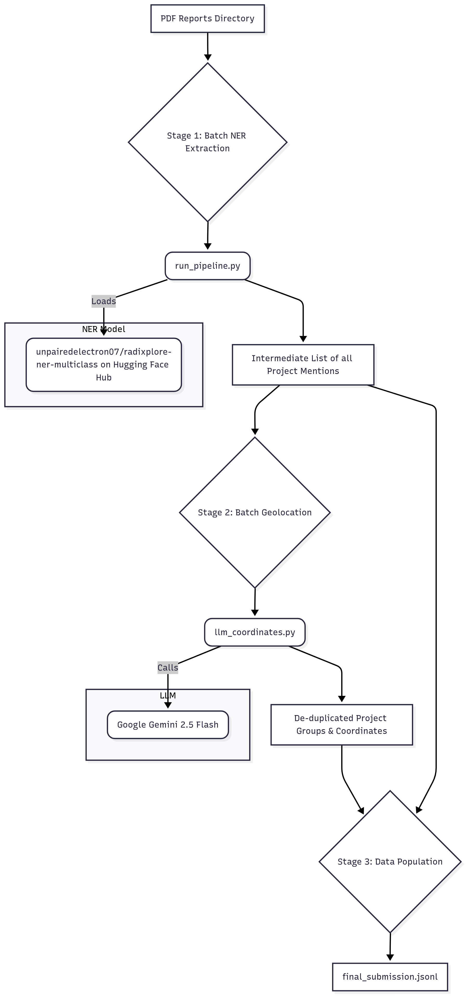

# RadiXplore: Mining Project Intelligence System

This repository contains the complete solution for the RadiXplore Candidate Coding Challenge. It's an end-to-end data pipeline that ingests unstructured PDF mining reports, identifies project entities using a custom-trained NER model, and infers their geographic coordinates using Google's Gemini 2.5 Flash Large Language Model.

## Final Pipeline Output

The system can process PDFs individually or as a complete batch. The final outputs, including a combined JSONL file for all reports and individual files for each report, are stored in the `/output` directory.

## System Architecture

The pipeline is designed as a three-stage batch process to maximize efficiency, especially during the expensive LLM inference step.



## Features

- High-Performance Text Extraction: Utilizes PyMuPDF for fast text extraction from complex PDF documents.

- Intelligent Entity Recognition: Employs a custom fine-tuned DistilBERT model, trained to identify PROJECT, ORGANIZATION, LOCATION, and PROSPECT entities with high precision.

- Cloud-Hosted Model: The trained NER model is deployed on HuggingFace Hub, allowing for seamless, on-demand loading without needing to store the model files locally in the repository. Check out: 

- Advanced Geolocation: Leverages Google's Gemini 2.5 Flash with its search grounding tool for robust, context-aware geolocation inference, and structured output for fixed, consistent schema of the output.

- Efficient Batch Processing: The final pipeline is architected to process an entire directory of documents efficiently. Through experimentation, it was observed that processing all 5 reports in a single batch call to the LLM takes ~45-50 seconds, a dramatic improvement over a sequential approach which would take over 175 seconds. This non-linear relationship between input volume and execution time highlights the power of modern LLM batching. For single PDF processing in the final_pipeline, the execution time was observed to be around 30-35 seconds consistently.

## Setup and Installation

Follow these steps to set up the environment and run the pipeline.

### Prerequisites

Python 3.9+

### Git

Clone the Repository

```python
git clone https://github.com/ishan-kshirsagar0-7/RadiXplore-Assignment.git
cd RadiXplore-Assignment
```

### Create and Activate a Virtual Environment

```bash
# Create the virtual environment
python -m venv venv

# Activate it (Windows PowerShell)
.\venv\Scripts\Activate.ps1

# Or activate it (Linux/macOS/Git Bash)
# source venv/bin/activate
```

### Install Dependencies
This project uses a `requirements.txt` file to ensure all dependencies and their exact versions are installed for perfect reproducibility.

```bash
pip install -r requirements.txt
```

### Configure API Keys
This repository includes a .env.example file for managing API keys.

1. Open the `.env.example` file.
2. Rename .env.example to `.env`
3. Replace the placeholder values with your actual API keys.

```bash
HF_TOKEN = "YOUR-HF-TOKEN-HERE"
GEMINI_API_KEY = "YOUR-GEMINI-API-KEY-HERE"
```

Link to get your own HF Token : https://huggingface.co/settings/tokens

Link to get your own Gemini API Key : https://aistudio.google.com/prompts/new_chat (then click on Get API Key up top).

## How to Run the Pipeline

The entire process is orchestrated by a single script. Make sure your `reports` folder contains the PDF files you wish to process.

To run the full pipeline on all reports in the /reports directory and generate a single combined output, execute the following command from the project root:

```python
python run_directory_pipeline.py
```

The script will print its progress through the three main stages and, upon completion, will generate the final final_submission.jsonl file inside the /output directory, along with time logging.

## Development Journey & Design Decisions

- The final architecture was the result of an iterative development process focused on improving model intelligence and pipeline efficiency.

- Initial Model (Single-Class NER): The first prototype was a standard NER model trained only to identify the PROJECT entity. While functional, it produced many false positives, often misclassifying locations and other entities as projects. This resulted in a peak F1-score of 0.61.

- The Insight (Multi-Class NER): To address the precision issue, the strategy shifted. A new model was trained on four distinct classes: PROJECT, PROSPECT, LOCATION, and ORGANIZATION. By teaching the model what a project is not, it became significantly more discerning and precise. This more intelligent model is now hosted on the Hugging Face Hub at unpairedelectron07/radixplore-ner-multiclass.

## Geolocation Strategy Evolution:

- Initial Idea: Use an LLM to directly infer coordinates without grounding it on google search, ultimately relying on its internal knowledge base. This was deemed too risky due to potential LLM hallucinations of numerical data.

- Hybrid Approach: A hybrid LLM + Geopy pipeline was considered, where the LLM finds the location name and geopy finds the coordinates.

- Final Architecture (Batch LLM): Through experimentation, a key insight was discovered—the latency of an LLM call is not linear with prompt size. A single, large batch call to the LLM to de-duplicate project names and find their coordinates was significantly more time-efficient (~75 seconds) than a sequential process would have been (~175+ seconds). This "batch reasoning" approach proved to be the most efficient and was adopted for the final pipeline.

## Future Scope

While the current pipeline is fully functional and highly efficient, several enhancements could be made to extend it into a full-fledged data intelligence application.

- Interactive Web Visualization: The most impactful next step would be to build a web application (e.g., using React and react-leaflet or react-globe.gl) to display the geolocated projects on an interactive 2D map or 3D globe. This would allow users to visually explore the data, click on project pins, and view the associated context and metadata.

- REST API Deployment: The core logic could be wrapped in a FastAPI application and deployed as a serverless function on a platform like Vercel or AWS Lambda. This would allow other services to programmatically submit documents for processing.

- Confidence-Based Filtering: The UI or API could include a threshold slider, allowing users to filter the displayed results based on the ner_confidence score to only show high-confidence extractions.

- Multi-Modal Fusion: As a bonus feature mentioned in the challenge, the system could be extended to incorporate visual cues from PDFs (e.g., analyzing maps or charts within the documents) to further refine or validate location data.

## Conclusion

This project successfully implements a robust, multi-stage pipeline for extracting and geolocating mining projects from unstructured text. By combining a custom-trained, cloud-hosted NER model with the advanced reasoning and search capabilities of Google's Gemini 2.5 Flash, the system achieves impressive performance. The final architecture prioritizes both the accuracy of the output and the efficiency of the process through intelligent batching, demonstrating a modern approach to solving complex data extraction challenges.
